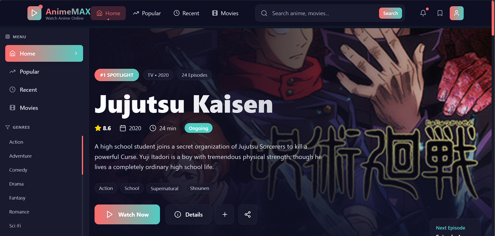

<h1 align="center">
  🎥 AnimeMAX - Stream Anime with Style
</h1>

<p align="center">
  A sleek and responsive anime streaming website UI built with <strong>React</strong>, <strong>Vite</strong>, and <strong>Tailwind CSS</strong>. Perfect for anime lovers and frontend devs looking for clean, modern design.
</p>

## ✨ Features

- ⚡ Blazing-fast development with **Vite**
- 🎨 Modern and responsive design with **Tailwind CSS**
- 📱 Fully mobile-friendly layout
- 🔍 Genre-based navigation and search UI
- 🌙 Beautiful dark-themed interface
- 🧩 Modular, reusable UI components

---

## 📸 Screenshots

> Home Page featuring “Jujutsu Kaisen”



---


## 🛠 Tech Stack

| Tech         | Purpose                        |
|--------------|-------------------------------|
| React        | UI rendering and state         |
| Vite         | Fast dev server and build tool |
| Tailwind CSS | Utility-first modern styling   |
| JSX / TSX    | Component structure & logic    |

---

## 🚀 Installation

### Prerequisites

Before you begin, make sure you have the following installed:

- **[Node.js](https://nodejs.org/)** (v16 or higher)
- **[Vite](https://vitejs.dev/)** (optional but recommended)
- **Tailwind CSS** (already configured in this project)

You can install Vite globally if desired:

```bash
npm install -g vite
````

---

### Run the Project

Clone the repository and start the development server:

```bash
# Clone the repo
git clone https://github.com/Player997/anime-streaming-site.git
cd anime-streaming-site

# Install all dependencies
npm install

# Start the development server
npm run dev
```

Open your browser and go to 👉 **[http://localhost:5173](http://localhost:5173)**

---

## 👨‍💻 Author

**Aditya**
🔗 [LinkedIn](https://www.linkedin.com/in/aditya-verma-aa8178288/)
💻 GitHub: [Player997](https://github.com/Player997)

